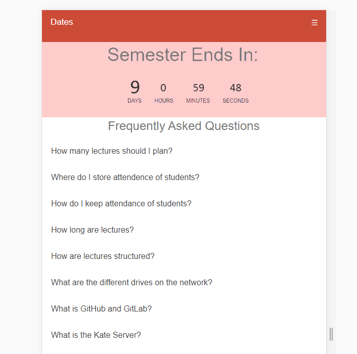

# Portfolio

This portfolio contains a sprint by sprint reflection of how our group project went. It includes my personal Professional and Technical proficiencies, and my thoughts on how I did, and how our team went as a whole. It documents my learning experience with new frameworks and languages. After each section below, there will be screenshots based off of what was talking about.

## Sprint 1

### Professional Proficiency:
To start things off, we were tasked to get into a group of about five members. I grouped up with James Kelly, Mitchell Briggs, Roynuka Nukanuka and Jamie Anderson. Within the first week of the first sprint we ended up losing Jamie as he had to fix his timetable conflictions, so we were left with only four members. Immediately this resulted in a need for a much more organised group. We decided we would try take up five people’s worth of work in the sprints if possible, so we could keep up with the flow.

Early on, James gathered together all the team members contact details in order to complete the team details page, and this allowed for us all to easily keep in contact with each other. This was a good start for the group, but by the end of the project, the part our group struggled with the most was communication. We all got each other’s contact details but didn’t use them nearly enough. If we had more communication, I feel like we would have easily finished all our tickets and been able to implement more extra features. It also would have meant we would have had much less last-minute sprints.

Before we started working together, James Mitchell and I knew each other personally, so we already saw each other on a regular basis so we knew we would be able to have daily scrums. We met Roy for the first time when doing this project and got to know him quite well. Due to having classes with him outside of Software Engineering, we normally used Software Engineering and our other classes together as our daily scrums. All four of us also took Web 2 so we often communicated in Web about how the project is going, and Roy and I both did Linux together, so we all saw each other on a regular basis.

Getting things started on GitHub, I created most of the GitHub pages and issues, assigned first pages to people who had previous experience in those fields took the JavaScript one as I already had worked doing something similar so was able to efficiently implement it into the website (reference agile principle about making as little work as possible). I ended up taking control of most of the GitHub pages, and was able to manage the team’s work flow through GitHub easily. For this first sprint, the idea was to create the initial website, with completely static tables. More of just a template website. We assigned roles that fit our strong points for the first sprint to get an idea of how the team would perform, and we all finished the first sprint easily and on time. 

Lastly, the big part of this sprint was to learn how to be Agile. Agile development is much different to any other development cycle I had used in the past. I was very much used to how I would develop programming material, so to have this new workflow introduced was a big change. I believe I quickly adapted well to this manor, as it seemed a lot more logical.

### Technical Proficiency:
As I had previous knowledge of JavaScript, I took up the FAQ page for the first sprint. I had done a similar FAQ styled page in the past, so I had an idea of what I would be doing, but still had to re learn the basics of JavaScript to allow me to be able to manipulate my old code to my likings. In this initial sprint, I laid out a basic website design as well based on previous frameworks I had used to allow the team to get an idea of the styling we should use to try and keep things consistent. Set up basic directories for everyone to use to help reduce the amount of migration conflictions caused. As we hadn’t started in Laravel, we each had an html page and we just worked inside our own folders.

## Sprint 2

### Professional Proficiency: 
No one in our team wanted to deal with the styling of our website, so I took up the design element. Before doing this I hardly knew about frameworks for website design and I had never actually used one (only learnt about Bootstrap in Year one Web). I ended up looking into some free frameworks. I wanted something different from other groups, so I chose Foundation as it allowed for a lot of personalisation. I chose not to use Bootstrap (which I had learnt about in Year 1) due to a lot of other groups using it.

After the departure of Jamie, we were left with the work he had briefly started so I decided to take up the work he had partially started and ended up working on the Public Holidays page as well. Jamie had started this page off but had formatted it a lot differently to what we wanted, and didn’t contain all the dates we needed, so I decided to just restart the whole page from scratch.

For the style of the website, I wanted something that was clean looking, but also could easily convert into mobile. In the first sprint, we had originally planned on having Jamie work on the accessibility side of the website, to allow for mobile use. However, after he left, we decided to scrap the accessibility until later in the project to allow more focus on presenting working software. So when designing the style, I chose to have everything nicely laid out to make it easier for whoever would eventually take up the mobile development role.

### Technical Proficiency:
 As none of us in the group were very good designers, I took up the mantle of taking care of the website’s design. I grabbed the CSS framework “Foundation” as a base CSS framework to have for the website. This gave it a somewhat professional look. I then implemented it with a previous framework which I have used for my web assignments which gave the website its own unique look, and not the generic bootstrap look.

The Public holidays page was nothing too special. Just a page with a table to display the holidays. However, doing it this way was a foundation for how we were going to do our tables in the future. We always wanted a consistent look to the website, and this ended up being a good starting point for consistent design.

If I was going to do this again, I would definitely have opted in for using Bootstrap since I had previous experience with it. I felt like Bootstrap may have provided a better-looking website, and the final design that I created I was not happy with. I knew that the design of the website wasn’t an important factor as this was a management tool, and not a general website so I did not get caught up on one little section. Once the design was finished, I asked the client for some feedback, and they decided they wanted a couple of things displayed a little differently, but overall, I believe they were satisfied enough with the design.

One last thing I did in this sprint, was divided up our stylesheet into sections. Each section is based on elements specific to different pages. This allowed for easy control of the source code. A big part of keeping on track and up to date with every other member’s work, was to be able to easily navigate what they have done, and understand what they have done, so I suggested we start using more comments in our code for the more complex parts. In the end, I think I was one of the only members who tried to comment out parts of my work, but luckily due to being able to talk to each other regularly, I didn’t struggle to keep up with other member’s work.

(Examples of this design can be seen in almost all of the screenshots provided in this report)

## Sprint 3

### Professional Proficiency: 
This sprint was one of the hardest sprints for us I believe. We had to learn a new PHP framework, something none of us had every experienced before. We dedicated this entire sprint to learning Laravel and helping each other out. On the first day of this sprint, we all worked on the Laravel tutorial individually to ensure we all got some early experience with how Laravel worked. I completed the tutorial, and the rest of the group either finished, or almost finished on that day so we all had a base understanding. For the next two weeks following this, we decided to ensure that everyone finished the tutorial, and hoped that everyone read over some documentation. Personally, for me, once I had read over some of the documentation of Laravel, I got a much better understanding of Laravel, and was able to explain it to the team, along side Mitchell who also got a clear early understanding.

### Technical Proficiency: 
We worked through the Laravel tutorial individually and then helped each other to make sure that everyone finished the tutorial as it gave us some key understandings of how Laravel worked. By the end of the tutorial, at least half of our team had a good understanding of how to use Laravel which meant we were able to move on to other sprints and help each other out.

I learnt how to deploy a website using the Laravel framework, and by the end of this sprint, we had deployed our old website using Laravel onto the server. This was not required or even asked for by the client at this point, and they were happily shocked to see we already had a live website working. Having implemented our website live earlier, meant we had extra time to figure out the key components of Laravel. By the end of the entire project, I believe everyone in the group felt rather confident using Laravel, and could navigate through all the Laravel files for the specific parts they needed to use.

## Sprint 4

### Professional Proficiency: 
This sprint was probably one of the harder sprints for me. I finally had to put the Laravel skills we learnt into practice. I had to make the ability to add and then edit public holidays in the database. I was able to finish this well and it gave me a much better understanding. However, Roy ended up not doing their part of the sprint, and to ensure we did not fall behind in our schedule, I took up the mantle of doing his sprint, continuing where he left off. As we were pushed for time, I was unable to meet him in person to be able to help him out, so instead I decided to just finish it for him, and then explain to him in person how I did it, and how he could do it in the future. Doing both tickets gave me a much better understanding of Laravel. Unfortunately, this showed that our communication was not up to par, as we didn’t realise that Roy was struggling until near the end of the sprint which led to the big rush at the end.

If in the future, I am working in a group environment and a member of my team is unable to complete a sprint, instead of doing the work for them, I would try and arrange a meeting with them one on one. This way I could see what they were struggling with, and hopefully resolve the issue. Unfortunately, for this sprint, I didn’t learn of the struggle until a day before our sprint was due, so I did not have time. It was much quicker for me to implement it as I had already done a similar section of the website, so I could quickly implement what I had already done for the other pages.

### Technical Proficiency: 
I ended up doing both the ability to add / edit public holidays as well as the ability to add / edit courses offered. Having to do both lots ended up being very time consuming, but it gave me a very good grasp of how Laravel worked. I learnt ways to reduce code duplication, and how to manipulate database data.

As Roy was unable to get some experience doing an Add / Edit page, we decided to ensure that he got something similar in a future sprint to make sure that he had a clearer understanding of Laravel. We created an Add / Edit page for a person to be added into the database. This would later help whoever was going to implement a Login system for the website and ended up being a very vital part of the website.

 

## Sprint 5

### Professional Proficiency: 
As this sprint occurred over the holidays, it was an optional sprint. I suggested that we each do a smell load of work since a lot of us probably didn’t have the time or ability to complete a large sprint. We worked out the little things that we needed to do / fix and we assigned them accordingly. I knew I was heading over to Australia for the entire 2 weeks of the holidays, so I was unable to complete a large sprint, and Mitchell was going to central Otago, so we knew we couldn’t assign too much work. We were already ahead of where we thought we needed to be at that point so deciding to do a smaller sprint was an easy decision. To keep up to date with everyone, we were unable to have scrums in person, so we just texted each other and used Discord.

Before this sprint, we were happy with where we stood for functionality of the website. We had the ability to add / edit almost everything that our client wanted. With the amount of working software, we had, it was a good indication of how our progress was going, and due to it being the holidays, we were not too worked up with how much work everyone got assigned. It was a free for all when deciding what each person wanted to do.

We did quite well to communicate while I was overseas. We tried using the GitHub chat service, but it was rather difficult to find the chat side of things, and while I was in Australia, my internet was not very stable, which caused the GitHub pages to constantly crash. We kept in contact mainly over text and discord, as these methods were much easier to manage.

### Technical Proficiency: 
For me, all I ended up doing was reformatting the course offerings page to display the course code in a different column to the course name. At the time, the table was static, so it required just reformatting how the table was designed. The most technical part of this sprint was deciding how much work was a good amount based on where everyone was spending their holidays. 

There wasn’t a lot more I could do for this sprint, which was fine at the time as we were on top of everything.

## Sprint 6

### Professional Proficiency: 
We decided to use this sprint as a “Final Functionality Sprint”. As I had previously ended up doing the add / edit course page which was meant for Roy, we decided to assign him to do an “Add Person” page to allow for a login system in the future. This allowed for him to display his own understanding of Laravel and hopefully make him more confident using it. For myself, I decided to finish off the course offerings page and make it fully functional by having it display all the courses from the database onto the website.

### Technical Proficiency: 
After the previous sprint, due to a merge conflict, the course offerings had a small display bug, so I fixed that up and then we got onto the sprint. After that it was a matter of learning the last parts of Laravel for our project, which was to understand how to display all the information stored in our database, onto the screen. This was not difficult for us as we had done similar things in our Web papers, and it allowed me to efficiently display all the course offerings onto the course offerings page.

For the display page, I read over some documentation on how to have a webpage display the information stored in a database. The documentation quickly told me the correct way to do this, and I was able to easily implement it. Reading the documentation provided me with a clear understanding of how I was going to achieve this, and reduced the trial and error which may have ended up happening. It also resulted in having the quickest and most efficient method.

(Refer to screenshot above to see the outcome of this)

## Sprint 7

### Professional Proficiency: 
This sprint was technically the final sprint. This was the last sprint we would have the full 2 weeks to complete it in, as well as the final sprint we would be given class time to work on it. We used this sprint as a final functionality sprint. I chose to take up the part of the website no one else wanted to do, which was the accessibility side. Originally this was meant to be done in the first couple of sprints and was assigned to a member of our team who ended up leaving, so we decided to leave it until the end as we didn’t have time to do it previously.

Unfortunately, Roy did not complete his sprint (nor did he even attempt to start it) and meant that we were missing his feature. I talked to him about it, and he was having a hard time keeping up with his workload from other classes, so I put his ticket into our next sprint. Luckily, we were very on top of our tickets at this point, so little slip ups like this were fine to happen.

### Technical Proficiency: 
I took control of the mobile development side of things. I had no idea how to implement a mobile ready site, so I did a lot of research, and one method that stuck out to me was to use an agent known as Jessengers Agent. This agent allowed for some very easy and flexible management of mobile devices. All it had to do to implement it was to read in the agent, then if I wanted something to display differently on a website, I just had to test if the website was running on a mobile device, then just create a nav bar that worked on mobile.

The mobile side of the website is probably the thing I am most proud of from this website. I had never had to implement mobile responsiveness properly into a website before, as previously I had only had to do it for Web checkpoints or using WordPress which did It for me. After spending a lot of time researching how to do it, I found a lot of different methods I could use to get it working. I chose to use an Agent which would allow me to control specific parts of the website depending on which platform I wanted them to be displayed on. There was probably other method I could have used to increase the work not done, however I feel like this method was the ‘closest to home’ for everyone in the group to understand, as it used if statements as its core.

 
 

This image shows that we don't lose any functionality between the desktop and mobile sites, the only thing different is how they display.

## Final Sprint

### Professional Proficiency: 
This sprint was not a proper sprint. Instead I got the team together to have a final “clean up” sprint. This was to clean up code, fix up any styling we didn’t like, add last minute features that would help please our client etc.

By the end of this sprint, we had fixed up all the known bugs at the time. The website was polished to a presentable standard, and we were all happy with it. However, the work that Roy did not complete in the previous sprint that we had assigned for this sprint still hadn’t been finished, which was rather disappointing. Its our entire groups fault for not communicating enough to realise that this part of the website wouldn’t get finished in time. It turned out that Roy was having some GitHub issues, and that when he pushed work into his repository, it wasn’t going onto GitHub. He had done about half of what he needed to do.

### Technical Proficiency:
Personally, I ended up cleaning up the mobile side of the website. I knew that in the previous sprint, I had made the mobile site usable but there were aspects that didn’t flow super nicely on mobile. I tried fixing some of them up but unfortunately was unable to fix a couple of pages.

This ‘sprint’ was rather small, it was only a week and a bit long, and was just to clean everything up. I believe we all cleaned up our website to a good standard and believed our client would like what we were able to present them.

One thing I decided to change was on the mobile version of the FAW page, due to the smaller screen, it was a little harder to see which FAQ tabs had already been opened, and which tab you were currently reading, so to fix this, I changed the colour of the most recently opened tab to be grey, and the colour of the preiovusly opened tabs to be green to give a clear indication.

And lastly, I fixed up some padding issues in parts of the website that had been forgotten about to ensure a much cleaner looking webite for our client.

 

## Between Sprints

Every second Thursday was the deadline for our sprints. On the Thursday we would all get together in Software Engineering and discuss what went well, what didn’t go well, and how we were going to approach the next sprint (while hopefully fixing any problems we had). As I had taken control of the GitHub pages, I ended up creating a wiki page each week in which we would briefly document the good and bad things from the sprint we had just completed. We would then come up with a plan on what we would improve on in the next sprint.

After discussing the previous sprint, we would then interview our client about other features that they would like implemented, and more specifically, which features they want in the next sprint.

## Summary

Overall, I believe that our group project was a success. I believe I personally learnt a lot about how to perform an agile approach to tasks in a group environment. I ended up taking the leadership role and sorted out the groups GitHub pages and assigned the work to everyone (along side them of course). We worked well as a team when we got together, and we almost always finished our work on time.

I learnt a lot of new technical skills, as well as some valuable group skills. I learnt that simple asking if someone was on track wasn’t always enough and learnt how valuable it was to having working software as a measure of progress. The agile skills learnt throughout this project will be very helpful in a working environment.

### CV

<a href="James Grigg - CV.docx" download>Download CV</a>
